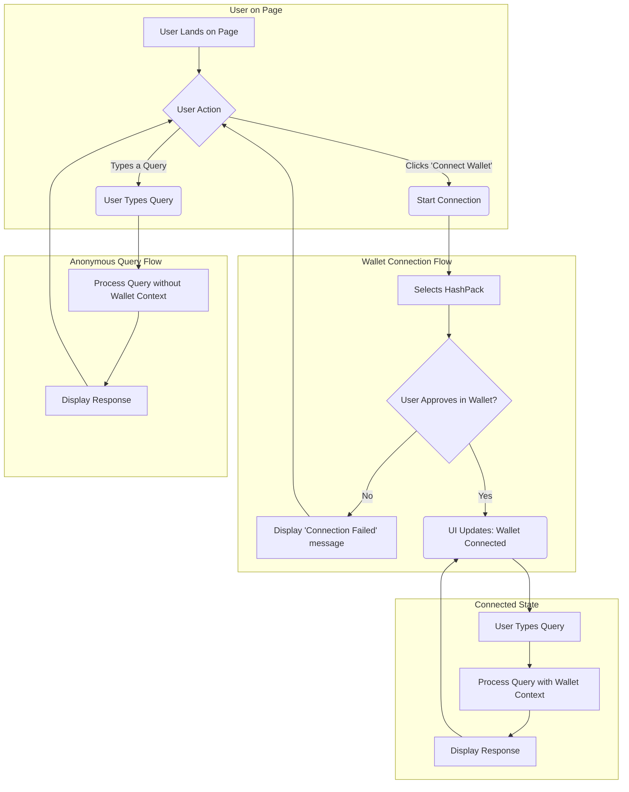
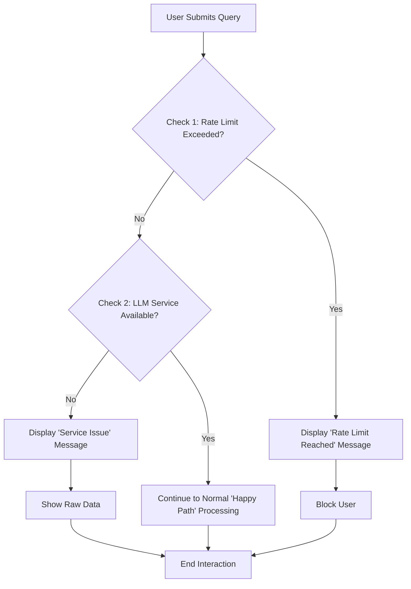

# Phase 1 Requirements : Hedera AI chain explorer (using Gem)

## 1. Business Case

### 1.1. Project Background and Vision

The Hbar Foundation is initiating a project, officially named **"THF AI Explorer,"** to develop a next-generation block explorer for the Hedera network. The core vision is **to enable anyone to consume and understand on-chain data by using natural language.**

### 1.2. Problem Statement

Traditional block explorers, while powerful for developers and crypto-native users, present a significant "comprehension gap" for the average user. They are often filled with technical data such as transaction hashes, cryptographic keys, and internal function names, which are confusing and require a steep learning curve to interpret correctly. This complexity creates a barrier to broader adoption and understanding of the Hedera ecosystem. The project aims to translate this technical data into a "human-readable" format.

### 1.3. Proposed Solution

The proposed solution is a chat-style "Smart Explorer" that leverages Large Language Models (LLMs). Users will interact with the system via a natural language chat interface, asking questions like "What tokens do I currently hold?" or "How much have I paid in gas fees this month?". The system will translate raw, on-chain transaction data into clean, narrative summaries (a "Smart View").

To achieve this, the solution will:

- Allow users to connect their personal wallets to receive contextualized, personalized responses.
- Utilize BigQuery to access and query Hedera's archival data.
- Augment queries with real-time, on-chain data (e.g., current gas fees) using a Model Context Protocol (MCP) that leverages the Hedera SDK.

### 1.4. Key Business Objectives

The success of the project's first phase will be measured by the following objectives:

- Deliver a working prototype of the chat-style, natural language-powered explorer.
- Successfully integrate with BigQuery to fetch archival Hedera data.
- Fetch real-time data from MCP/Hedera SDK.
- Enable user wallet connectivity to personalize the query context.
- Provide a "Smart View" that presents transaction data in a human-readable format.
  - Build a core infrastructure that is extensible for future features, analytics, and monetization opportunities.

## 2. Scope Definitions and Constraints

Based on our discussion, the following scope and constraints are defined for the "THF AI Explorer" Phase 1 MVP:

### 2.1. Wallet Integration

- **Supported Wallet:** Phase 1 will exclusively support **HashPack** for wallet connectivity.
- **Future Scope:** Support for other wallets (e.g., MetaMask, Blade Wallet, Atomic Wallet) is deferred to a future phase.

### 2.2. LLM Dependency and Fallback Behavior

- **Architectural Decision:** The specific choice of LLM (e.g., local vs. a commercial API) is deferred to the architectural design phase.

### 2.3. Security and Abuse Prevention

- **Rate Limiting:** To prevent spam or abuse, the system will implement a rate-limiting mechanism on user queries (e.g., a maximum number of messages per minute/hour).
  - Rate limits should be easily configurable without needing a new code deployment.
- **User Security Warning:** The UI must display a prominent and clear warning to users, instructing them **NEVER** to share their private keys or seed phrases with the application.

### 2.4. User Chat History

- We can show the user their chat history, but only within the current session (once they lose their session they will not be able to review past chats or continue them).
- We want to save an anonymized & GDPR-compliant chat history on our end, so that we can review chat trends and ideate on the AI agent improvements.

### **2.5. Global Non-Functional Requirement: Multi-Chain Extensibility**

- **NFR-G1 (Architecture):** The entire system architecture should be designed with blockchain abstraction in mind. The goal is to create a core framework that can be extended to support other blockchains (e.g., Ethereum, Solana) in the future with minimal refactoring of the central application logic.
  - **Data Source Abstraction:** The logic for querying data (e.g., from BigQuery) should be separated from the core application via an abstraction layer. This will allow for different data sources for different chains to be "plugged in" in the future.
  - **Wallet Integration Abstraction:** The wallet connection module (as defined in NFR-3.3) should be abstracted to handle different wallet standards and APIs.
  - **Transaction Logic Abstraction:** The "Smart View" summarization logic should be designed to operate on a standardized, internal data format. This means that data from any chain would first be transformed into this common format before being processed, making the summarization logic itself chain-agnostic.

## **3. Phase 1 (MVP) Core Features**

### **3.1 Natural Language Chat Interface**

- **Feature Description:** The system will provide a chat-style interface where users can input questions, see suggestions, receive responses, and manage the conversation flow.
- **Functional Requirements:**
  - **FR-1.1:** The system **MUST** provide a text input field for users to type in queries.
    - **Acceptance Criteria:**
      1. Given a user is on the main page, a text input field is visible.
      2. When the user types, the text appears in the input field.
      3. The input field contains placeholder text, such as "Ask a question...", when empty.
  - **FR-1.2:** The system **MUST** provide a mechanism for the user to submit their query.
    - **Acceptance Criteria:**
      1. Given the user has typed a query in the input field, pressing the "Enter" key submits the query.
      2. Given the user has typed a query, clicking a "Submit" icon/button submits the query.
  - **FR-1.3:** The system **MUST** display a list of pre-defined, suggested queries.
    - **Acceptance Criteria:**
      1. Given a user is on the main page, a list of suggested queries is visible.
      2. When a user clicks on a suggested query, that query's text populates the input field and is submitted (TBC if this will be clickable - UX decision).
  - **FR-1.4:** The system **MUST** provide a mechanism for the user to stop the bot's response generation mid-flow.
    - **Acceptance Criteria:**
      1. Given the bot is actively generating a response, the “Submit” button must be replaced with a “Stop” button.
      2. When the user clicks the "Stop" button, the response generation ceases immediately.
      3. After generation is stopped, the chat input controls are re-enabled.
      4. The system **MUST** prevent users from submitting a new query while the bot is generating a response.
  - **FR-1.5:** The system **MUST** allow a user to edit their previously submitted queries.
    - **Acceptance Criteria:**
      1. Given a previously submitted user query, an "Edit" control is available.
      2. When the user activates "Edit," their message becomes a editable text field.
      3. The user can modify the text and re-submit it.
  - **FR-1.6:** When an edited query is re-submitted, the system **MUST** update the conversation from that point forward.
    - **Acceptance Criteria:**
      1. Given a user edits and re-submits a query, all subsequent messages (from both the bot and the user) that appeared after the original query **MUST** be removed from the conversation history.
      2. The system **MUST** generate a new response based on the content of the edited query.
- **Non-Functional Requirements:**
  - **NFR-1.1 (Usability):** The chat interface **SHOULD** be intuitive and resemble modern chat applications.
  - **NFR-1.2 (Performance):** The user's typed characters **MUST** appear in the input field with no perceptible delay.

### **3.2 Smart View Transaction Summarization**

- **Feature Description:** The system will translate raw on-chain transaction and wallet data into clean, human-readable narrative summaries for any specified public address or the user's connected wallet.
- **Functional Requirements:**
  - **FR-2.1:** The system **MUST** generate a narrative summary for token swap transactions.
    - **Acceptance Criteria:**
      1. Given a token swap transaction, the summary **MUST** include the date, the assets and amounts exchanged, the dApp used (if identifiable), and the fee paid.
  - **FR-2.2:** The system **MUST** generate a portfolio composition summary.
    - **Acceptance Criteria:**
      1. Given a query for a portfolio breakdown, the system generates a summary detailing the percentage allocation between asset classes (e.g., stablecoins, NFTs, altcoins).
  - **FR-2.3:** The system **MUST** generate a narrative summary for simple P2P (Peer-to-Peer) token transfers.
    - **Acceptance Criteria:**
      1. Given a transfer of HBAR or any HTS token, the summary **MUST** identify the sender and recipient addresses, the amount and type of token transferred, the date, and the fee paid.
  - **FR-2.4:** The system **MUST** generate a narrative summary for NFT (Non-Fungible Token) transactions.
    - **Acceptance Criteria:**
      1. Given an NFT mint transaction, the summary **MUST** identify the minter's wallet and the NFT collection name.
      2. Given an NFT transfer transaction, the summary **MUST** identify the sender, the recipient, and the specific NFT collection involved.
  - **FR-2.5:** The system **MUST** generate a narrative summary for token association transactions.
    - **Acceptance Criteria:**
      1. Given a transaction where a wallet associates with a new token, the summary **MUST** identify the wallet and the token.
      2. The summary **SHOULD** use clear language, such as "On [Date], this wallet was set up to receive [Token Name]."
  - **FR-2.6: Supported MVP Query Types:** The system **MUST** be able to parse and provide accurate answers for queries similar in pattern and complexity to the examples provided in the following categories:
    - **Current Wallet State:** (e.g., "What tokens do I currently hold?", "What is the total value of my wallet?")
    - **Simple Transaction History:** (e.g., "Show my last 5 transactions.", "What happened in transaction [tx hash]?")
  - **FR-2.7: Educational Responses for Invalid Scenarios:** For questions that don’t concern the chain or the state of the chain (i.e. “How do I set up a wallet?”) the bot should not go into detailed explanations and should not answer. We can experiment with the extent to which the bot answers such questions when we’re setting up the LLM instructions.
  - **FR-2.8: Public Address Queries:** The system **MUST** be able to process queries related to any valid public Hedera address.
- **Non-Functional Requirements:**
  - **NFR-2.1 (Accuracy):** All numerical data in the summary **MUST** be factually accurate.
  - **NFR-2.2 (Clarity):** The language **SHOULD** be simple and clear.
  - **NFR-2.3 (Consistency):** The summary format for similar transaction types **SHOULD** be consistent.

### **3.3 Wallet Integration**

- **Feature Description:** The system allows users to connect their personal wallet to receive contextualized, personalized responses. For the MVP, this is limited to a single HashPack wallet connection.
- **Functional Requirements:**
  - **FR-3.1:** The system **MUST** provide a "Connect Wallet" button for the user to initiate the connection process.
    - **Acceptance Criteria:**
      1. A "Connect Wallet" button is clearly visible on the page when the user is in an anonymous state.
  - **FR-3.2:** The system **MUST** exclusively support **HashPack** for wallet connections in Phase 1.
    - **Acceptance Criteria:**
      1. When the user initiates a connection, "HashPack" is presented as the sole connection option.
  - **FR-3.3:** Upon successful connection, the UI **MUST** update to clearly indicate the connected state.
    - **Acceptance Criteria:**
      1. The user's wallet address is displayed in a designated area of the UI.
      2. The "Connect Wallet" button is replaced by a "Disconnect" button or a similar control.
  - **FR-3.4:** The system **MUST** provide a mechanism for the user to disconnect their wallet.
    - **Acceptance Criteria:**
      1. When the user clicks the "Disconnect" button, the session returns to the anonymous state.
      2. The connected wallet address is removed from the UI.
      3. The "Connect Wallet" button becomes visible again.
  - **FR-3.5:** The system **MUST** handle a failed wallet connection attempt gracefully.
    - **Acceptance Criteria:**
      1. If the user rejects the connection request within the HashPack wallet, a non-intrusive "Connection Failed" message is displayed to the user.
      2. The user's session remains in the anonymous state.
  - **FR-3.6:** When a wallet is connected, the system **MUST** use that wallet's address as the automatic context for relevant queries.
    - **Acceptance Criteria:**
      1. Given a wallet is connected, if the user asks "Show me my tokens," the system processes the query for the connected address without prompting for an address.
- **Non-Functional Requirements:**
  - **NFR-3.1 (Security):** The wallet connection process **MUST** be secure and follow standard Web3 security practices.
  - **NFR-3.2 (Usability):** The connection flow **SHOULD** be simple, intuitive, and consistent with common dApp connection patterns.
  - **NFR-3.3 (Extensibility):** The wallet connection module **MUST** be architected in a way that allows for the addition of new wallet providers in the future with minimal refactoring of the core connection logic. The initial implementation should abstract the wallet-specific logic.

### **3.4 BigQuery Integration**

- **Feature Description:** The system uses a connection to a BigQuery dataset containing Hedera archival data as the primary source for historical analysis. It must be able to translate natural language questions into efficient SQL queries to retrieve this data.
- **Functional Requirements:**
  - **FR-4.1:** The system **MUST** use a BigQuery database as its source for historical Hedera ledger data.
    - **Acceptance Criteria:**
      1. The system can successfully establish a connection and authenticate with the designated BigQuery dataset.
  - **FR-4.2:** The system **MUST** translate relevant natural language queries into valid BigQuery SQL queries.
    - **Acceptance Criteria:**
      1. Given a user query for transactions within a specific date range, the system generates a SQL query containing a `WHERE` clause that correctly filters by timestamp.
      2. Given a user query for a specific wallet, the system generates a SQL query that correctly filters by that wallet's public address.
  - **FR-4.3:** The BigQuery integration **MUST** provide access to the data required to support all other features.
    - **Acceptance Criteria:**
      1. The system can retrieve transaction records for a given wallet address.
      2. The system can retrieve token balances for a given wallet address.
      3. The system can retrieve NFT ownership records and history for a given wallet address.
- **Non-Functional Requirements:**
  - **NFR-4.1 (Performance):** The system's queries **SHOULD** be optimized to return results from BigQuery in a timely manner suitable for an interactive chat application.
  - **NFR-4.2 (Accuracy):** Data retrieved from BigQuery **MUST** be an accurate and complete reflection of the underlying archival data.
  - **NFR-4.3 (Cost-Effectiveness):** The system's SQL query generation logic **SHOULD** be designed to be efficient to minimize query costs on the BigQuery platform.

### **3.5 Real-Time Data via Hedera SDK**

- **Feature Description:** This feature augments the system's responses by providing live, on-chain data sourced from the Hedera network in near-real-time. This is achieved through the Hedera SDK that gets information directly from the Mirror Nodes.
- **Functional Requirements:**
  - **FR-5.1:** The system **MUST** augment chat responses with live on-chain data by querying the Hedera SDK.
    - **Acceptance Criteria:**
      1. The system can successfully query the Mirror Nodes server to retrieve data.
  - **FR-5.2:** The system **MUST** provide access to current network gas fees.
    - **Acceptance Criteria:**
      1. The system can successfully answer a user query such as "What's the current gas fee?" with up-to-date data.
  - **FR-5.3:** The system **MUST** provide access to very recent user transactions that may not yet be available in the BigQuery archival data.
    - **Acceptance Criteria:**
      1. The system can successfully answer a user query such as "What was my last transaction?" by fetching the data via the Hedera SDK.
- **Non-Functional Requirements:**
  - **NFR-5.1 (Data Freshness):** The data provided **MUST** be a near-real-time reflection of the current state of the Hedera network.
  - **NFR-5.2 (Performance):** Queries for real-time data **MUST** have low latency to be effective for an interactive chat application.
  - **NFR-5.3 (Reliability):** The system's connection to the data sources (e.g., Mirror Node ) **MUST** be reliable, with graceful handling for any potential connection issues.

### **3.6 Default Dashboard**

- **Feature Description:** An information panel that is immediately visible to all users upon visiting the site. It displays a curated set of key metrics for the Hedera ecosystem.
- **Functional Requirements:**
  - **FR-6.1:** The system **MUST** display the Default Dashboard on the main page.
    - **Acceptance Criteria:**
      1. The dashboard component is visible on page load for both anonymous and connected users.
  - **FR-6.2:** The dashboard **MUST** display the following HBAR-specific metrics:
    - **Acceptance Criteria:**
      1. The current price of HBAR in a major fiat currency (e.g., USD) is displayed.
      2. The current market capitalization of HBAR is displayed.
      3. The current circulating supply of HBAR is displayed.
      4. The amount and/or percentage of HBAR currently being staked is displayed.
  - **FR-6.3:** The dashboard **MUST** display the following ecosystem-wide metrics:
    - **Acceptance Criteria:**
      1. The number of active accounts on the network (e.g., over the last 24 hours) is displayed.
- **Non-Functional Requirements:**
  - **NFR-6.1 (Data Freshness):** The data displayed on the dashboard **SHOULD** be periodically updated and reasonably current. It does not need to be real-time to the second.
  - **NFR-6.2 (Usability):** The dashboard **MUST** be presented in a clear, visually appealing, and easily scannable format, ensuring users can quickly digest the information.
  - **NFR-6.3 (Performance):** The loading of the dashboard data **MUST NOT** block the rendering of the primary chat interface or significantly slow down the application's initial load time.

### **3.7 System Behavior & Error Handling**

- **Feature Description:** Defines the system's standard behavior for handling operational constraints, security warnings, and service interruptions to ensure a predictable and secure user experience.
- **Functional Requirements:**

  - **FR-7.1: LLM Service Unavailability:** In the event the LLM summarization service is unavailable, the system **MUST** respond gracefully.
    - **Acceptance Criteria:**
      1. The system displays a clear message to the user explaining there is a temporary issue with the AI service.
  - **FR-7.2: Rate Limiting:** The system **MUST** enforce a query rate limit to prevent spam and abuse.
    - **Acceptance Criteria:**
      1. When a user exceeds the defined rate limit, the system displays a message explaining the limit has been reached.
      2. After displaying the message, the system **MUST** temporarily block the user from submitting new queries.
  - **FR-7.3: User Security Warning:** The system **MUST** display a persistent, prominent warning about sharing sensitive information.
    - **Acceptance Criteria:**
      1. The UI displays a clear and easily visible message instructing users **NEVER** to share their private keys or seed phrases.
  - **FR-7.3: Logging:** It’ll be very useful if the system can log the following information, that can be used for tracking the usage / stability and certain trends in order to help with improvements for Phase 2:

    - wallet connect with timestamp (along with success or fail)

    - user prompt to the bot with timestamp (along with success or fail)

    - new session, along with start and end timestamp

    - bot response time (not sure if we can get things like latency and success rate for BigQuery and SDK calls)

    - rate limit triggers

    - any other error thrown by the system (to help troubleshoot)

    - thumbs up / thumbs down for bot messages, along with the chat history and message ID (so we can know exactly which chat and which message was OK / NOT OK).

- **Non-Functional Requirements:**
  - **NFR-7.1 (Configurability):** The parameters for rate limiting (e.g., number of messages per minute) **MUST** be configurable without requiring a new code deployment.

## **4. Business Process: Primary User Journey**

### 4.1. Process Diagram

### 4.2. Textual Process Description

**A. Initial State & User Choice**

1. A user arrives at the THF AI Explorer homepage. The user is in an "Anonymous" state by default. The **Default Dashboard** is displayed, showing key network metrics.
2. The user has two primary choices:
   - Proceed to ask a question directly as an anonymous user (Go to section C).
   - Attempt to connect their wallet (Go to section B).

**B. Wallet Connection Process**

1. The user clicks the "Connect Wallet" button.
2. The system prompts them to select "HashPack".
3. The HashPack wallet extension prompts the user for connection approval.
4. **Decision Point:**
   - **If the user REJECTS the connection:** The system displays a "Connection Failed" notification. The user is returned to the "Anonymous" state.
   - **If the user APPROVES the connection:** The application UI updates to a "Connected" state, typically by displaying the user's wallet address. The user can now proceed to ask questions with their wallet context automatically included (Go to section D).

**C. Querying as an Anonymous User**

1. The user types a question into the chat interface and submits it.
2. The system processes the query without any wallet context.
   - _Note: If a wallet-specific query is asked (e.g., "What's in my wallet?"), the system will return a response indicating that a wallet connection is required for such questions._
3. The system displays the response. The user is then ready to ask another question.

**D. Querying as a Connected User**

1. The user, whose wallet is already connected, types a question into the chat interface and submits it.
2. The system automatically applies the connected wallet's address as context for the query.
3. The system processes the query and displays the "Smart View" response.
4. The user remains in the "Connected" state, ready to ask another question.

### **5. Business Process: Error & Limit Handling**

### 5.1. Process Diagram

### 5.2. Textual Process Description

This process begins immediately after a user (either anonymous or connected) submits a query.

1. **Query Submitted:** The user submits a query to the system.
2. **Check 1: Rate Limit:** The system first checks if the user has exceeded their permitted query rate (e.g., messages per minute/hour).
   - **If YES:**
     - The system displays a message explaining that the rate limit has been reached.
     - The system will temporarily block the user from making further queries.
     - The flow for this query ends.
   - **If NO:** The system proceeds to the next check.
3. **Check 2: LLM Service Availability:** The system then checks if it can communicate with the backend LLM service.
   - **If the service is NOT available:**
     - The system displays a message to the user explaining there is a temporary technical issue with the AI summarization service.
     - The flow for this query ends.
   - **If the service IS available:** The query proceeds down the "Happy Path" for normal processing and "Smart View" summarization, as detailed in our primary user journey.
